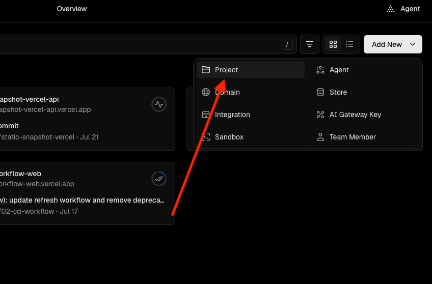
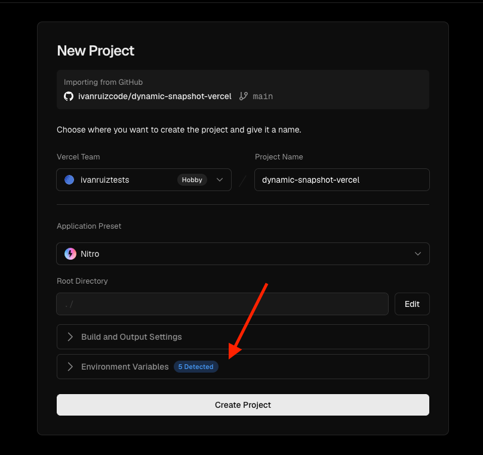
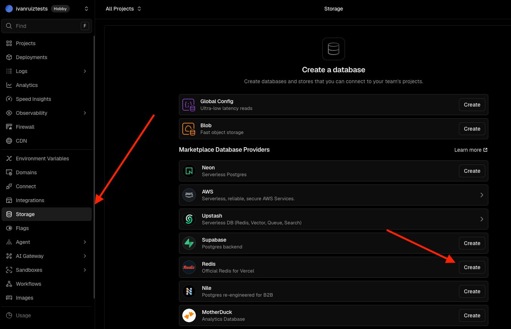
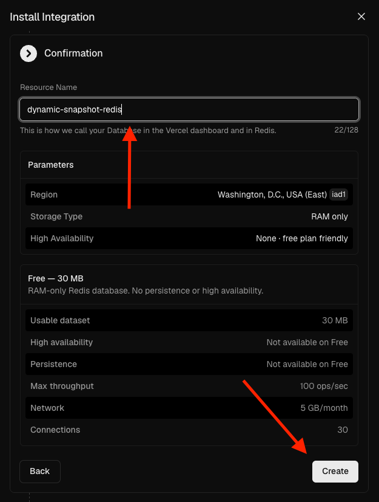
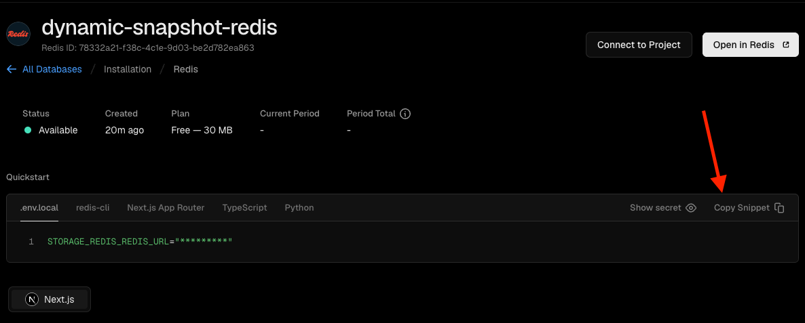
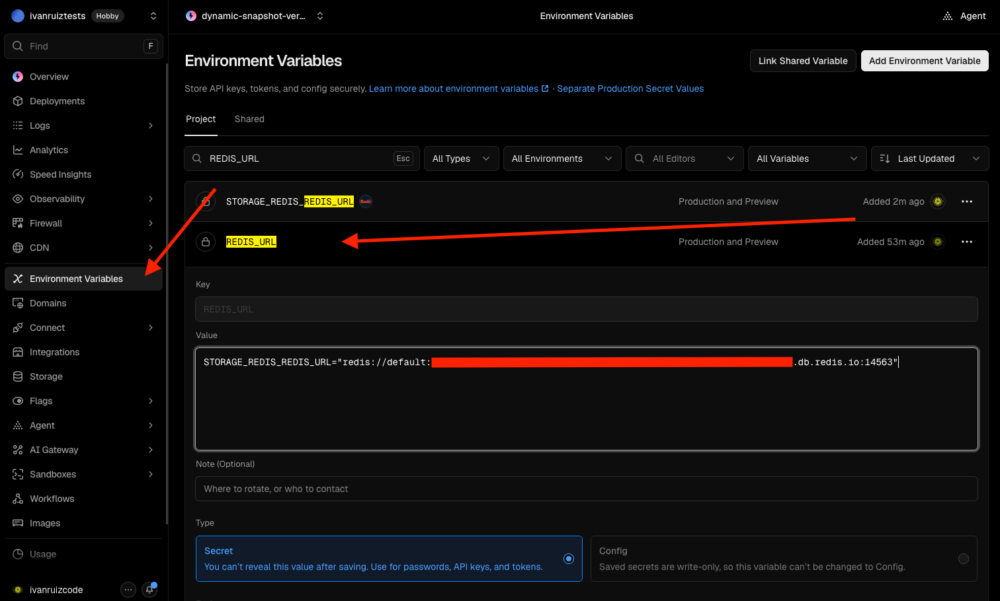
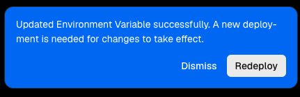
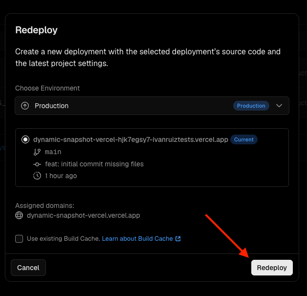
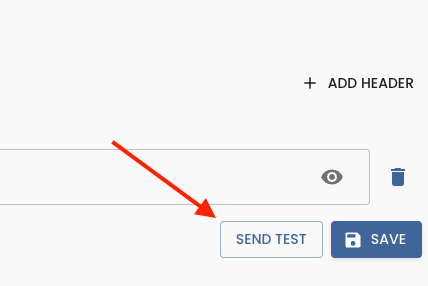
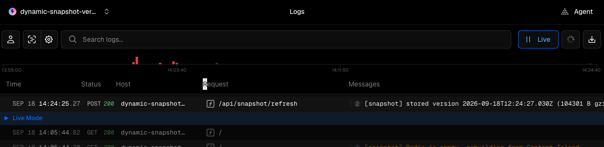

# Dynamic Snapshot on Vercel

*[Versión en español](./README_es.md)*

# Step 0: Create a GitHub repository with your project's code

Before you start, you need to have the `01-local` code pushed to a GitHub repository. That is the starting point for this example. The code is the same, but now it's time to deploy it to Vercel together with Redis.

# Step 1: Create a project in Vercel

In the Vercel dashboard, with your GitHub account connected, click the `Add New` button and select `Project`:

A new page will open where you can select the repository you just pushed to GitHub. Select the repository and click `Import`:

Once you have imported the project, Vercel will show you a new window where you can do the basic project configuration. In this case, we only need to change the environment variables:

 

Here we can add the environment variables manually:

- CONTENT_ISLAND_ACCESS_TOKEN: The read token of your Content Island project. You can find it in the `General` section of your Content Island project.
- CONTENT_ISLAND_PROJECT_ID: (Optional) It only prefixes the Redis key, so that two environments pointing to different Content Island projects can share the same instance.
- REDIS_URL: The URL of your Redis instance. We leave it empty for now until we create it in the next step.
- SNAPSHOT_REFRESH_SECRET: A secret key used to refresh the snapshots securely. You can generate a random key with the command `openssl rand -hex 32` in your terminal.
- SNAPSHOT_CHECK_INTERVAL_MS: The time interval, in milliseconds, used to check whether the content has changed. In production you can set 300000 (5 minutes), and in development you can set 10000 (10 seconds) so it refreshes faster and you can check that it works.

Once you have finished adding the environment variables, click `Deploy`.

# Step 2: Create a Redis instance in Vercel

Now let's create a Redis instance in Vercel. To do so, inside the project dashboard go to Storage and, under Marketplace Database Providers, select Redis.

On the Install Integration screen, configure the region, the storage type and the availability of the instance. You'll see that all installation plans are paid, but Vercel offers a free plan if you select **None — free plan friendly** under the `High Availability` option. When you're done, click the continue button.

Now we move on to the confirmation step to create the instance, where we enter the instance name and click `Create`:

Once created, Vercel will ask us to assign a project and a prefix for the Redis URL environment variable. We can't use the same name as the one we already created, so we'll use "STORAGE_REDIS_URL".

Once this is done, we can copy the Redis URL and paste it into the project's environment variable.

Once configured, a message will pop up in the bottom-left corner saying that the environment variable has been updated and that we can redeploy for it to take effect. We click `Redeploy` to apply it.

# Step 3: Configure the Custom HTTP Webhook in Content Island

For the next step, we need the URL of our project deployed on Vercel. To get it, we go to the `Overview` section and copy the project URL.

Once in Content Island, we go to the `Webhooks` section, click `Add Webhook` and select `Custom HTTP Webhook`.

The creation form has 2 parts. The first one is the webhook configuration, where we enter the webhook name and, further down, the URL of our deployed project.

Below that we have the `Headers` section, where we must add a header named `x-refresh-secret` whose value is the secret variable.

# Step 4: Check that it works

We can test that the webhook works correctly in two different ways. The first one is by clicking the `Send Test` button inside the webhook:

And then checking the Vercel logs, where we'll see that the request has been received:

The second way is by making a change to the content in Content Island and checking that the snapshot refreshes automatically. To do so, we go to the `Content` section, make any change and publish it. Once published, Content Island will send the request to the webhook and Vercel will refresh the snapshot automatically. We can verify it by checking the Vercel logs or by reloading the page and seeing that the content has changed.
